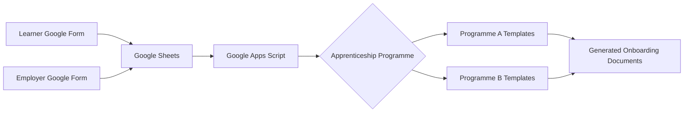

# Apprenticeship Enrolment & Onboarding Automation

## Overview

This project automates a repetitive learner onboarding process for an
apprenticeship training organisation, built using Google Forms, Google
Sheets, and Google Apps Script.

Learner and employer information is collected through two Google Forms,
consolidated into a central spreadsheet, and used to automatically
generate the onboarding documents each learner needs — with the correct
document set selected based on which apprenticeship programme they're
enrolling on.

This is a **sanitised, public version** of a system built for a real
training provider. All personal data, company names, and Google Workspace
identifiers have been removed or replaced with fictional examples — see
[Data Privacy](#data-privacy) below.

## Business Problem

Before this system existed, learner and employer information collected
during enrolment had to be manually re-typed into several separate
onboarding documents for each learner. This created repetitive
administrative work, increased the risk of inconsistent information
between documents, and made it harder to maintain a single, up-to-date
record of who was enrolled on what.

## Solution

The system I built:

1. Collects learner information via a **Google Form**, and employer
   confirmation via a second **Google Form**.
2. Feeds both into a central **Google Sheet** acting as the
   organisation's learner database.
3. Uses **Google Apps Script** to process submissions, match learners to
   employers, and keep derived fields (age, key dates, tenure) up to
   date automatically.
4. Applies **conditional logic** to select the correct set of document
   templates for the learner's apprenticeship programme.
5. **Auto-populates** the required onboarding documents from **Google
   Docs templates** and exports them as PDFs.
6. Logs every generated document for traceability.

## Workflow



See [`docs/workflow.md`](docs/workflow.md) for the full step-by-step
walkthrough, and [`docs/architecture.md`](docs/architecture.md) for how
the script is structured.

## Key Features

- Centralised learner and employer records in a single spreadsheet
- Automated processing of Google Forms submissions
- Duplicate-learner protection on enrolment
- Automatic matching of employer confirmations back to the right learner
- Automatically recalculated derived fields (age, end dates, tenure)
- Conditional template selection based on apprenticeship programme
- Automated document population and PDF export
- Idempotent document generation (safe to re-trigger without duplicating)
- Document generation log for auditability
- Reduced duplicate data entry and a standardised onboarding workflow

## Technologies

- Google Apps Script (JavaScript)
- Google Forms
- Google Sheets
- Google Docs
- Google Drive

## Code Structure

```
src/
  config.gs               Configuration placeholders + Settings-sheet reader
  utilities.gs             Shared helper functions
  template-selection.gs    Programme → document template routing logic
  form-processing.gs       Form submission handling + derived-field logic
  document-generation.gs   Document generation, PDF export, finalisation
```

Full breakdown in [`docs/architecture.md`](docs/architecture.md).

## Example Process

Alex Taylor submits the Learner Form to enrol on **Programme A**. Their
employer, Example Analytics Ltd, submits the Employer Form with their
line manager's details.

1. The learner's information lands in the central spreadsheet and a new
   Learner ID (`LRN-00001`) is generated.
2. The employer submission is matched back to Alex's record by name and
   company, filling in the line manager fields.
3. Once Alex's record is complete, staff mark it **Ready to Generate**.
4. The script selects the Programme A templates, fills in Alex's details,
   and generates the Apprenticeship Agreement, Enrolment Pack, and
   Learner Diagnostics documents as both Google Docs and PDFs.
5. Each generated document is logged for tracking.

See [`sample-data/example-learners.csv`](sample-data/example-learners.csv)
for a small fictional dataset built from the same column structure as the
real system.

## Business Impact

- Reduced repetitive copying of learner information between multiple
  documents
- Created a single centralised learner record in place of scattered
  paperwork
- Standardised the preparation of onboarding documentation across
  apprenticeship programmes
- Reduced the amount of manual administration required during enrolment
- Manual enrolments took around 25 minutes on average, whereas the
  automated system takes 3 minutes. This saves 22 minutes of time per
  learner; for 100 learners, that is over 36 hours saved, an entire
  working week!


## Challenges / Technical Decisions

- **Matching employer submissions to the right learner.** Learner and
  employer information arrives via two independent forms, submitted at
  different times by different people. The system matches them by
  normalising and comparing learner name + company name, with duplicate-
  match detection to fail loudly rather than silently update the wrong
  record.
- **Selecting the right templates per programme.** Different
  apprenticeship programmes need different document sets. Template
  selection is centralised in one place (`template-selection.gs`) rather
  than repeated inline in each generation workflow.
- **Keeping derived fields correct as data changes.** Several fields
  (age at enrolment, apprenticeship end date, length of employment) are
  calculated from other date fields and need to stay correct if those
  dates are edited later — handled by a dedicated recalculation function
  triggered on edit.
- **Avoiding duplicate document generation.** Because generation can be
  triggered more than once (a status accidentally re-set, a trigger
  re-run), each workflow checks for an existing document before creating
  a new one.

## What I Learned

- Translating a manual, paper-heavy operational process into a
  structured, automated workflow
- Designing data collection (form fields, sheet structure) around what
  the downstream automation actually needs
- Implementing conditional business rules driven by real-world categories
  (apprenticeship programmes) rather than generic switches
- Automating document generation and export at scale using a
  template/placeholder pattern
- Structuring a single-file Apps Script project into logical,
  maintainable pieces without over-engineering it

## Data Privacy

This public repository contains a **sanitised representation** of the
original implementation. All learner, employer, company, and Google
Workspace identifiers (Drive folder IDs, Docs/Sheets/Forms IDs, real
names, emails, phone numbers, addresses, and apprenticeship programme
names) have been removed or replaced with fictional/example values. No
production learner data is included anywhere in this repository.

## Interview Preparation

<details>
<summary><strong>60–90 second summary (STAR)</strong></summary>

**Situation:** The apprenticeship training organisation I worked with
onboarded every learner by manually re-entering the same information —
collected separately from the learner and their employer — into several
different documents, for every apprenticeship programme they ran.

**Task:** I needed to remove that repetitive manual step, make sure the
right documents were produced for the right programme, and give the
organisation one reliable, centralised record of who was enrolled.

**Action:** I built the intake using two Google Forms (learner and
employer), feeding into a central Google Sheet as the learner database.
I used Google Apps Script to process submissions, match employer
confirmations back to the right learner, apply conditional logic to
select the correct templates for each apprenticeship programme, and
auto-populate and export the required onboarding documents as PDFs — with
a document log for traceability and checks to avoid generating duplicates.

**Result:** Learner and employer information now only needs to be entered
once. Onboarding documents are generated consistently from the same
source data instead of being manually retyped, and the organisation has
a single centralised learner record instead of scattered paperwork.

</details>

<details>
<summary><strong>5 likely interview questions</strong></summary>

1. **How did you handle matching two independent form submissions
   (learner and employer) to the same person?**
   By normalising and comparing learner name + company name across both
   forms, with explicit error handling for zero or multiple matches
   rather than silently guessing.

2. **What happens if the automation runs twice for the same learner?**
   Each document-generation workflow checks whether that document
   already exists for the learner before creating a new one — the
   workflows are idempotent by design.

3. **How is the system configured — are IDs hardcoded?**
   No. Drive folder IDs, template IDs, and ID prefixes are stored in a
   `Settings` sheet and read at runtime, so non-technical staff can
   update configuration without touching the script.

4. **How did you decide which document template to use for a given
   learner?**
   Template selection is centralised in one function that takes a
   learner's programme code and the document type being generated, and
   looks up the matching template ID — rather than repeating the same
   conditional logic in every generation workflow.

5. **What would you improve if you rebuilt this today?**
   Be ready to talk honestly here about real limitations you noticed —
   e.g. Apps Script's execution-time limits at higher volumes, or moving
   configuration into Script Properties instead of a spreadsheet.

</details>
