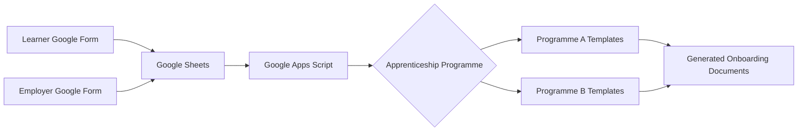

# Workflow

Step-by-step walkthrough of a single learner's journey through the
system, from form submission to generated onboarding documents.

## 1. Learner submits the enrolment form

The learner fills in the Learner Google Form: personal details, employer
name, chosen apprenticeship programme, and (where relevant) supporting
documents. This lands as a new row in the `Learner Form Responses - Raw`
sheet, which triggers `onFormSubmit()`.

## 2. Learner and Employer records are created

`onFormSubmit()`:

- Resolves the submitted course answer to an internal programme code.
- Matches the submitted employer against existing `Employers` records by
  company name, or creates a new one.
- Runs duplicate-learner protection (matching first name, surname, email,
  and date of birth against existing learners).
- Generates the next sequential Learner ID and writes a new row to the
  `Learners` sheet.

## 3. Employer confirms their details

Separately, the employer/line manager fills in the Employer Google Form
(their own contact details and an e-signature). `handleEmployerFormSubmit()`
matches this back to the correct learner record (by learner name +
company name) and fills in the line manager fields on the `Learners` row.

## 4. Derived fields are kept up to date

Whenever a date field the learner's timeline depends on is edited (date
of birth, employment start date, apprenticeship start date, practical
period start date), `onEdit()` calls `calculateLearnerDerivedFields_()` to
recompute age at enrolment, the practical period end date, the
apprenticeship end date, and length of employment at enrolment.

## 5. Staff mark the learner ready for documents

Once a learner's record is complete, staff set **Paperwork Status** to
`Ready to Generate` on the `Learners` sheet. `handlePaperworkStatusEdit()`
picks this up and runs all three document-generation workflows in
sequence.

## 6. Documents are generated

For each document type (Apprenticeship Agreement, Enrolment Pack, Learner
Diagnostics), the corresponding workflow:

1. Confirms the learner record has everything the document needs.
2. Selects the correct template for the learner's programme.
3. Copies the template into the learner's Drive folder.
4. Replaces every `{{PLACEHOLDER}}` token with the learner's data.
5. Exports a PDF alongside the generated Google Doc.
6. Updates the learner's status fields and appends a row to
   `Document Logs`.

## 7. Signatures and finalisation

As the generated documents move through eSignature, staff update
**Signature Request Status** on the `Learners` sheet. When this reaches
`Completed`, `handlePaperworkStatusEdit()` calls `finaliseEnrolment_()` to
mark the learner's enrolment as complete.
